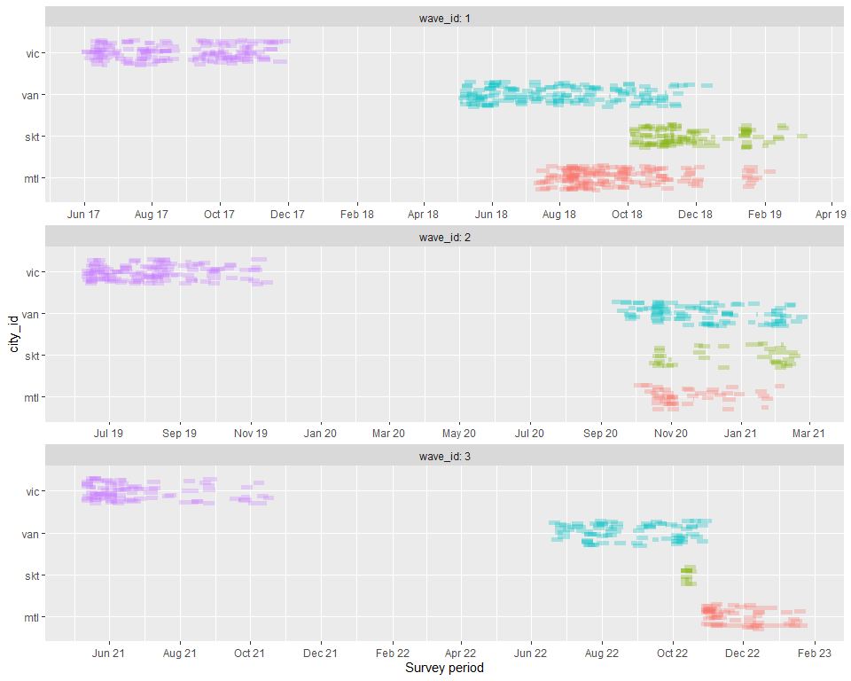
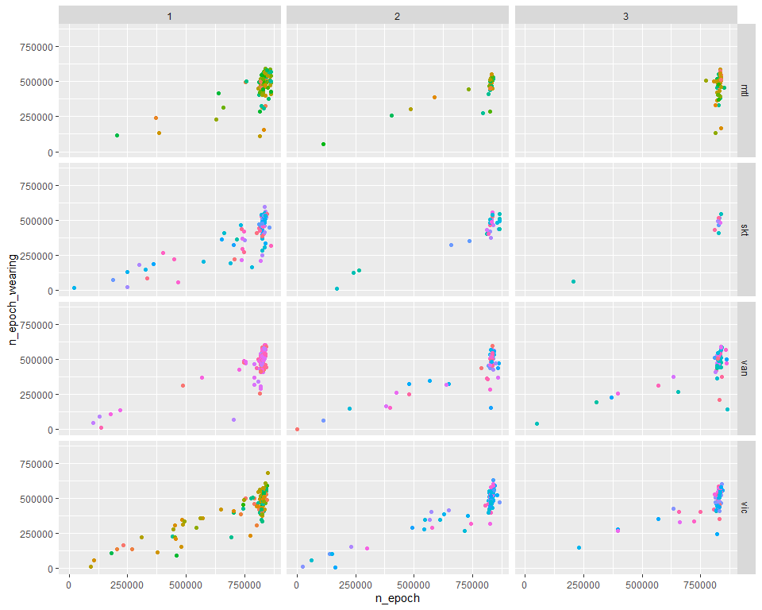
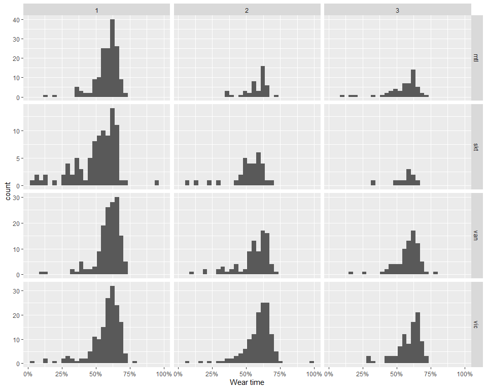
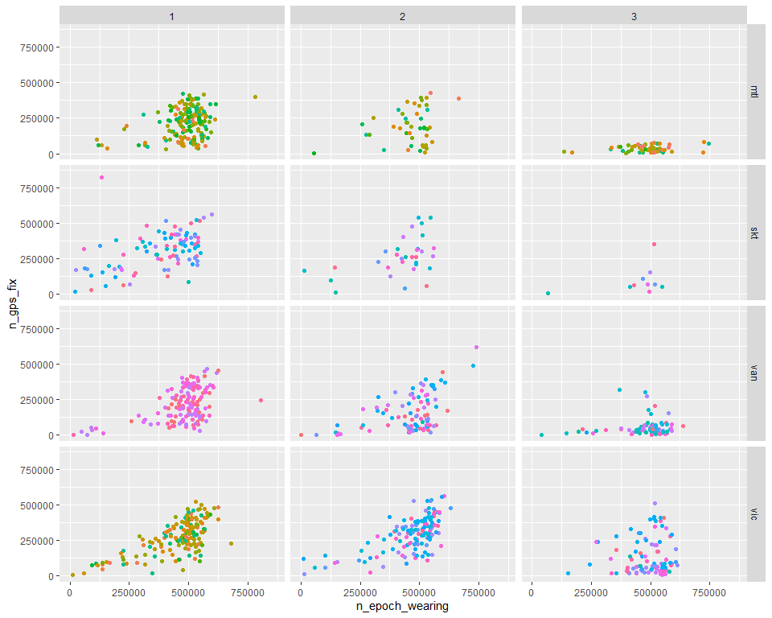
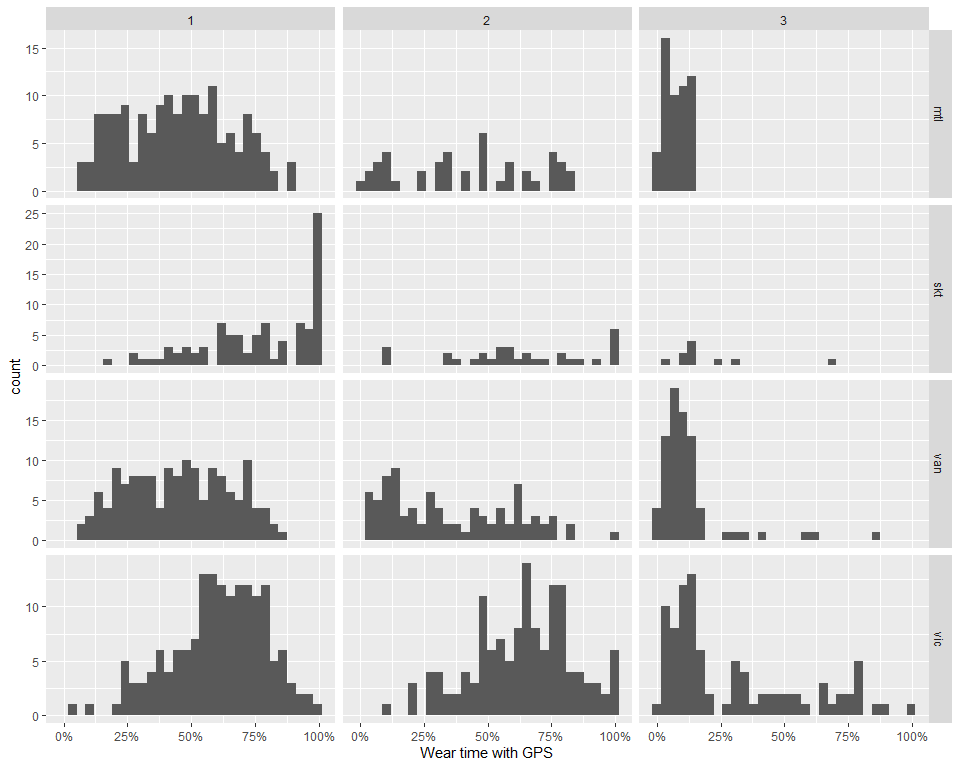
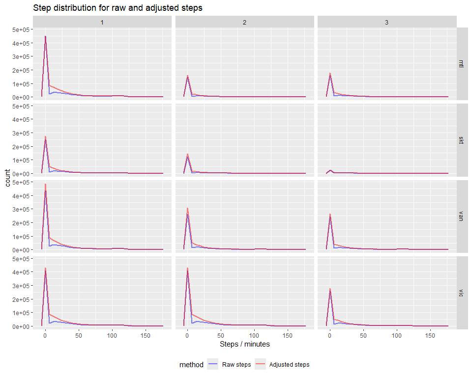
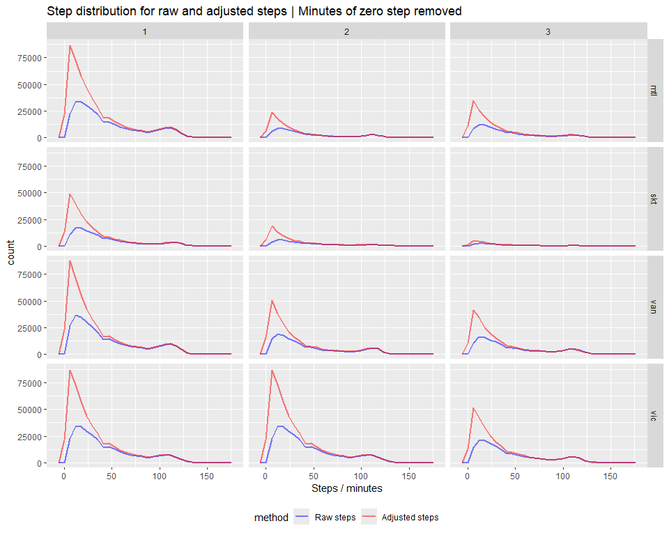
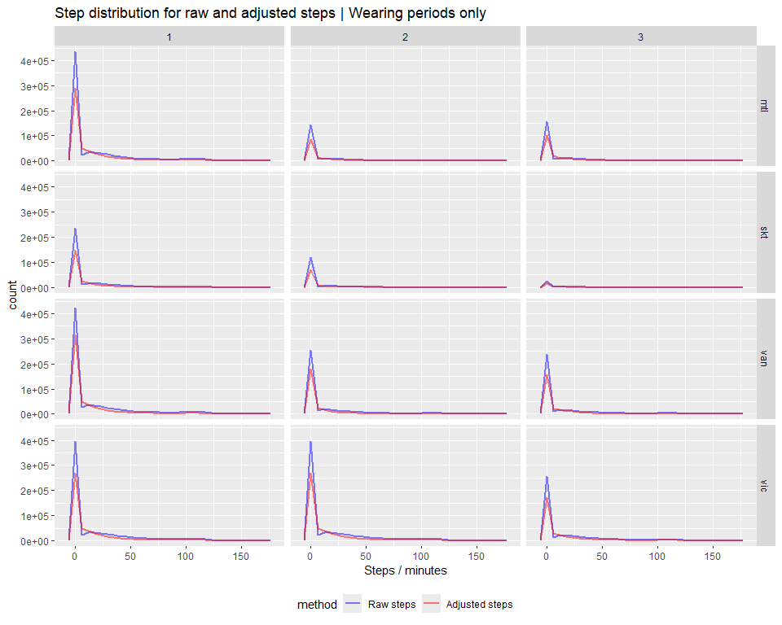
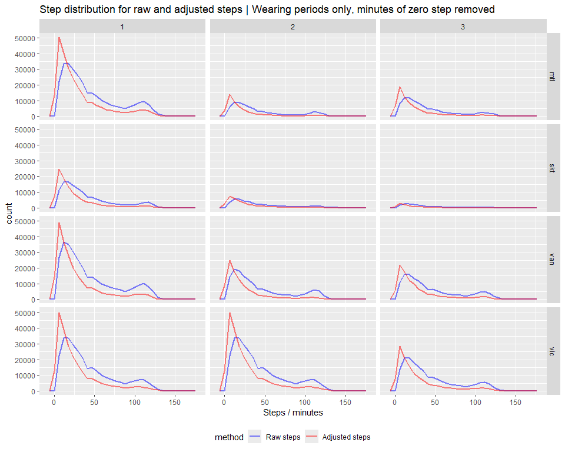

# QA objectives

Create summary statistics (see `QA` subfolder):

+ date ranges
+ number of days of data per participant
+ min, max, SD distributions
+ GPS locations
+ [Sept. 2025] Step statistics

# Data coverage

## Get data from database


``` sql
select city_id, wave_id, interact_id, sd_id
	,min(utcdate) start_time, max(utcdate) end_time
	,max(utcdate) - min(utcdate) survey_duration
	,count(*) n_epoch
	,sum(wearing) n_epoch_wearing
	,count(lat) n_gps_fix
from (
	SELECT 'mtl' city_id, 1 wave_id
		,ts.*, tm.wearing
	FROM top_sd.top_1sec_mtl ts,
		top_sd.top_1min_mtl tm
	WHERE ts.interact_id = tm.interact_id AND ts.sd_id = tm.sd_id
		AND date_trunc('minute', ts.utcdate) = tm.utcdate) as foo
group by city_id, wave_id, interact_id, sd_id
  -- Get Mtl / w2
UNION
select city_id, wave_id, interact_id, sd_id
	,min(utcdate) start_time, max(utcdate) end_time
	,max(utcdate) - min(utcdate) survey_duration
	,count(*) n_epoch
	,sum(wearing) n_epoch_wearing
	,count(lat) n_gps_fix
from (
	SELECT 'mtl' city_id, 2 wave_id
		,ts.*, tm.wearing
	FROM top_sd2.top_1sec_mtl ts,
		top_sd2.top_1min_mtl tm
	WHERE ts.interact_id = tm.interact_id AND ts.sd_id = tm.sd_id
		AND date_trunc('minute', ts.utcdate) = tm.utcdate) as foo
group by city_id, wave_id, interact_id, sd_id
  -- Get Mtl / w3
UNION
select city_id, wave_id, interact_id, sd_id
	,min(utcdate) start_time, max(utcdate) end_time
	,max(utcdate) - min(utcdate) survey_duration
	,count(*) n_epoch
	,sum(wearing) n_epoch_wearing
	,count(lat) n_gps_fix
from (
	SELECT 'mtl' city_id, 3 wave_id
		,ts.*, tm.wearing
	FROM top_sd3.top_1sec_mtl ts,
		top_sd3.top_1min_mtl tm
	WHERE ts.interact_id = tm.interact_id AND ts.sd_id = tm.sd_id
		AND date_trunc('minute', ts.utcdate) = tm.utcdate) as foo
group by city_id, wave_id, interact_id, sd_id
  -- Get Skt / w1
UNION
select city_id, wave_id, interact_id, sd_id
	,min(utcdate) start_time, max(utcdate) end_time
	,max(utcdate) - min(utcdate) survey_duration
	,count(*) n_epoch
	,sum(wearing) n_epoch_wearing
	,count(lat) n_gps_fix
from (
	SELECT 'skt' city_id, 1 wave_id
		,ts.*, tm.wearing
	FROM top_sd.top_1sec_skt ts,
		top_sd.top_1min_skt tm
	WHERE ts.interact_id = tm.interact_id AND ts.sd_id = tm.sd_id
		AND date_trunc('minute', ts.utcdate) = tm.utcdate) as foo
group by city_id, wave_id, interact_id, sd_id
  -- Get Skt / w2
UNION
select city_id, wave_id, interact_id, sd_id
	,min(utcdate) start_time, max(utcdate) end_time
	,max(utcdate) - min(utcdate) survey_duration
	,count(*) n_epoch
	,sum(wearing) n_epoch_wearing
	,count(lat) n_gps_fix
from (
	SELECT 'skt' city_id, 2 wave_id
		,ts.*, tm.wearing
	FROM top_sd2.top_1sec_skt ts,
		top_sd2.top_1min_skt tm
	WHERE ts.interact_id = tm.interact_id AND ts.sd_id = tm.sd_id
		AND date_trunc('minute', ts.utcdate) = tm.utcdate) as foo
group by city_id, wave_id, interact_id, sd_id
  -- Get skt / w3
UNION
select city_id, wave_id, interact_id, sd_id
	,min(utcdate) start_time, max(utcdate) end_time
	,max(utcdate) - min(utcdate) survey_duration
	,count(*) n_epoch
	,sum(wearing) n_epoch_wearing
	,count(lat) n_gps_fix
from (
	SELECT 'skt' city_id, 3 wave_id
		,ts.*, tm.wearing
	FROM top_sd3.top_1sec_skt ts,
		top_sd3.top_1min_skt tm
	WHERE ts.interact_id = tm.interact_id AND ts.sd_id = tm.sd_id
		AND date_trunc('minute', ts.utcdate) = tm.utcdate) as foo
group by city_id, wave_id, interact_id, sd_id
  -- Get van / w1
UNION
select city_id, wave_id, interact_id, sd_id
	,min(utcdate) start_time, max(utcdate) end_time
	,max(utcdate) - min(utcdate) survey_duration
	,count(*) n_epoch
	,sum(wearing) n_epoch_wearing
	,count(lat) n_gps_fix
from (
	SELECT 'van' city_id, 1 wave_id
		,ts.*, tm.wearing
	FROM top_sd.top_1sec_van ts,
		top_sd.top_1min_van tm
	WHERE ts.interact_id = tm.interact_id AND ts.sd_id = tm.sd_id
		AND date_trunc('minute', ts.utcdate) = tm.utcdate) as foo
group by city_id, wave_id, interact_id, sd_id
  -- Get van / w2
UNION
select city_id, wave_id, interact_id, sd_id
	,min(utcdate) start_time, max(utcdate) end_time
	,max(utcdate) - min(utcdate) survey_duration
	,count(*) n_epoch
	,sum(wearing) n_epoch_wearing
	,count(lat) n_gps_fix
from (
	SELECT 'van' city_id, 2 wave_id
		,ts.*, tm.wearing
	FROM top_sd2.top_1sec_van ts,
		top_sd2.top_1min_van tm
	WHERE ts.interact_id = tm.interact_id AND ts.sd_id = tm.sd_id
		AND date_trunc('minute', ts.utcdate) = tm.utcdate) as foo
group by city_id, wave_id, interact_id, sd_id
  -- Get van / w3
UNION
select city_id, wave_id, interact_id, sd_id
	,min(utcdate) start_time, max(utcdate) end_time
	,max(utcdate) - min(utcdate) survey_duration
	,count(*) n_epoch
	,sum(wearing) n_epoch_wearing
	,count(lat) n_gps_fix
from (
	SELECT 'van' city_id, 3 wave_id
		,ts.*, tm.wearing
	FROM top_sd3.top_1sec_van ts,
		top_sd3.top_1min_van tm
	WHERE ts.interact_id = tm.interact_id AND ts.sd_id = tm.sd_id
		AND date_trunc('minute', ts.utcdate) = tm.utcdate) as foo
group by city_id, wave_id, interact_id, sd_id
  -- Get vic / w1
UNION
select city_id, wave_id, interact_id, sd_id
	,min(utcdate) start_time, max(utcdate) end_time
	,max(utcdate) - min(utcdate) survey_duration
	,count(*) n_epoch
	,sum(wearing) n_epoch_wearing
	,count(lat) n_gps_fix
from (
	SELECT 'vic' city_id, 1 wave_id
		,ts.*, tm.wearing
	FROM top_sd.top_1sec_vic ts,
		top_sd.top_1min_vic tm
	WHERE ts.interact_id = tm.interact_id AND ts.sd_id = tm.sd_id
		AND date_trunc('minute', ts.utcdate) = tm.utcdate) as foo
group by city_id, wave_id, interact_id, sd_id
  -- Get vic / w2
UNION
select city_id, wave_id, interact_id, sd_id
	,min(utcdate) start_time, max(utcdate) end_time
	,max(utcdate) - min(utcdate) survey_duration
	,count(*) n_epoch
	,sum(wearing) n_epoch_wearing
	,count(lat) n_gps_fix
from (
	SELECT 'vic' city_id, 2 wave_id
		,ts.*, tm.wearing
	FROM top_sd2.top_1sec_vic ts,
		top_sd2.top_1min_vic tm
	WHERE ts.interact_id = tm.interact_id AND ts.sd_id = tm.sd_id
		AND date_trunc('minute', ts.utcdate) = tm.utcdate) as foo
group by city_id, wave_id, interact_id, sd_id
-- Get vic / w3
UNION
select city_id, wave_id, interact_id, sd_id
	,min(utcdate) start_time, max(utcdate) end_time
	,max(utcdate) - min(utcdate) survey_duration
	,count(*) n_epoch
	,sum(wearing) n_epoch_wearing
	,count(lat) n_gps_fix
from (
	SELECT 'vic' city_id, 3 wave_id
		,ts.*, tm.wearing
	FROM top_sd3.top_1sec_vic ts,
		top_sd3.top_1min_vic tm
	WHERE ts.interact_id = tm.interact_id AND ts.sd_id = tm.sd_id
		AND date_trunc('minute', ts.utcdate) = tm.utcdate) as foo
group by city_id, wave_id, interact_id, sd_id
```


``` r
head(top_1s_agg)
```

<div data-pagedtable="false">
  <script data-pagedtable-source type="application/json">
{"columns":[{"label":[""],"name":["_rn_"],"type":[""],"align":["left"]},{"label":["city_id"],"name":[1],"type":["chr"],"align":["left"]},{"label":["wave_id"],"name":[2],"type":["int"],"align":["right"]},{"label":["interact_id"],"name":[3],"type":["int"],"align":["right"]},{"label":["sd_id"],"name":[4],"type":["int"],"align":["right"]},{"label":["start_time"],"name":[5],"type":["dttm"],"align":["right"]},{"label":["end_time"],"name":[6],"type":["dttm"],"align":["right"]},{"label":["survey_duration"],"name":[7],"type":["chr"],"align":["left"]},{"label":["n_epoch"],"name":[8],"type":["int64"],"align":["right"]},{"label":["n_epoch_wearing"],"name":[9],"type":["int64"],"align":["right"]},{"label":["n_gps_fix"],"name":[10],"type":["int64"],"align":["right"]}],"data":[{"1":"vic","2":"3","3":"103772760","4":"357","5":"2021-05-25 16:08:19","6":"2021-06-04 06:59:58","7":"9 days 14:51:39","8":"831100","9":"550140","10":"59853","_rn_":"1"},{"1":"skt","2":"2","3":"302619633","4":"312","5":"2020-10-20 13:09:32","6":"2020-10-23 14:58:38","7":"3 days 01:49:06","8":"265747","9":"145719","10":"15200","_rn_":"2"},{"1":"van","2":"3","3":"203842375","4":"451","5":"2022-07-24 13:31:40","6":"2022-08-03 06:13:11","7":"9 days 16:41:31","8":"837692","9":"589752","10":"77296","_rn_":"3"},{"1":"van","2":"1","3":"201585258","4":"445","5":"2018-08-22 14:07:11","6":"2018-09-01 03:12:32","7":"9 days 13:05:21","8":"824722","9":"431133","10":"261061","_rn_":"4"},{"1":"mtl","2":"1","3":"401178032","4":"96","5":"2019-01-11 11:41:22","6":"2019-01-21 02:10:44","7":"9 days 14:29:22","8":"829763","9":"524205","10":"275790","_rn_":"5"},{"1":"van","2":"2","3":"201140482","4":"375","5":"2020-09-10 14:59:52","6":"2020-09-27 03:35:11","7":"16 days 12:35:19","8":"1427720","9":"455100","10":"223106","_rn_":"6"}],"options":{"columns":{"min":{},"max":[10]},"rows":{"min":[10],"max":[10]},"pages":{}}}
  </script>
</div>

## Survey time span


``` r
top_1s_agg |>
  mutate(
    sdate = as_date(start_time),
    edate = as_date(end_time)
  ) |>
  ggplot() +
  geom_segment(
    aes(
      x = sdate,
      xend = edate,
      y = city_id,
      color = city_id
  ),
    linewidth = 2,
    alpha = .3,
    position = position_jitter(width = 0, height = .3)
  ) +
  scale_x_date(name = "Survey period", date_breaks = "2 month", date_labels = "%b %y") +
  facet_wrap(vars(wave_id), ncol = 1, scales = "free", labeller = label_both) +
  theme(legend.position = "none")
```

<!-- -->

## Wear time vs total survey time


``` r
top_1s_agg |>
  ggplot() +
  geom_point(aes(x=n_epoch, y=n_epoch_wearing, color=factor(sd_id))) +
  xlim(0, 10 * 24 * 3600) + ylim(0, 10 * 24 * 3600) + # Define theoretical max of survey n_epoch, i.e. 10 days
  facet_grid(rows = vars(city_id), cols = vars(wave_id)) +
  theme(legend.position = "none")
```

```
## Warning: Removed 156 rows containing missing values or values outside the scale range
## (`geom_point()`).
```

<!-- -->


``` r
top_1s_agg |>
  mutate(`Wear time` = n_epoch_wearing / n_epoch) |>
  ggplot() +
  geom_histogram(aes(x = `Wear time`)) +
  scale_x_continuous(labels = scales::percent) +
  facet_grid(rows = vars(city_id), cols = vars(wave_id), scales = "free_y")
```

```
## `stat_bin()` using `bins = 30`. Pick better value with `binwidth`.
```

<!-- -->

## Wear time with GPS fix


``` r
top_1s_agg |>
  ggplot() +
  geom_point(aes(x=n_epoch_wearing, y=n_gps_fix, color=factor(sd_id))) +
  xlim(0, 10 * 24 * 3600) + ylim(0, 10 * 24 * 3600) + # Define theoretical max of survey n_epoch, i.e. 10 days
  facet_grid(rows = vars(city_id), cols = vars(wave_id)) +
  theme(legend.position = "none")
```

```
## Warning: Removed 2 rows containing missing values or values outside the scale range
## (`geom_point()`).
```

<!-- -->


``` r
top_1s_agg |>
  mutate(`Wear time with GPS` = pmin(n_gps_fix / n_epoch_wearing, 1)) |>
  ggplot() +
  geom_histogram(aes(x = `Wear time with GPS`)) +
  scale_x_continuous(labels = scales::percent) +
  facet_grid(rows = vars(city_id), cols = vars(wave_id), scales = "free_y")
```

```
## `stat_bin()` using `bins = 30`. Pick better value with `binwidth`.
```

<!-- -->

## Step statistcs

Steps have been added in September 2025 following the Bernard Asante's work. Steps are computing according to the Python package `stepcount` (see [repo](https://github.com/OxWearables/stepcount)) based on _Small SR, Chan S, Walmsley R, et al. (2024) Self-Supervised Machine Learning to Characterize Step Counts from Wrist-Worn Accelerometers in the UK Biobank. Medicine & Science in Sports & Exercise. DOI: 10.1249/MSS.0000000000003478_


``` sql
select 'mtl' city_id, 1 wave_id,
  utcdate at time zone 'America/Montreal' datetime,
  wearing, steps, steps_adj
from top_sd.top_1min_mtl
union
select 'skt' city_id, 1 wave_id,
  utcdate at time zone 'America/Regina' datetime,
  wearing, steps, steps_adj
from top_sd.top_1min_skt
union
select 'van' city_id, 1 wave_id,
  utcdate at time zone 'America/Vancouver' datetime,
  wearing, steps, steps_adj
from top_sd.top_1min_van
union
select 'vic' city_id, 1 wave_id,
  utcdate at time zone 'America/Vancouver' datetime,
  wearing, steps, steps_adj
from top_sd.top_1min_vic
union
select 'mtl' city_id, 2 wave_id,
  utcdate at time zone 'America/Montreal' datetime,
  wearing, steps, steps_adj
from top_sd2.top_1min_mtl
union
select 'skt' city_id, 2 wave_id,
  utcdate at time zone 'America/Regina' datetime,
  wearing, steps, steps_adj
from top_sd2.top_1min_skt
union
select 'van' city_id, 2 wave_id,
  utcdate at time zone 'America/Vancouver' datetime,
  wearing, steps, steps_adj
from top_sd2.top_1min_van
union
select 'vic' city_id, 2 wave_id,
  utcdate at time zone 'America/Vancouver' datetime,
  wearing, steps, steps_adj
from top_sd.top_1min_vic
union
select 'mtl' city_id, 3 wave_id,
  utcdate at time zone 'America/Montreal' datetime,
  wearing, steps, steps_adj
from top_sd3.top_1min_mtl
union
select 'skt' city_id, 3 wave_id,
  utcdate at time zone 'America/Regina' datetime,
  wearing, steps, steps_adj
from top_sd3.top_1min_skt
union
select 'van' city_id, 3 wave_id,
  utcdate at time zone 'America/Vancouver' datetime,
  wearing, steps, steps_adj
from top_sd3.top_1min_van
union
select 'vic' city_id, 3 wave_id,
  utcdate at time zone 'America/Vancouver' datetime,
  wearing, steps, steps_adj
from top_sd3.top_1min_vic
```

### All epochs


``` r
top_1m |>
  select(steps, steps_adj) |>
  summary()
```

```
##      steps           steps_adj      
##  Min.   :  0       Min.   :  0.00   
##  1st Qu.:  0       1st Qu.:  0.00   
##  Median :  0       Median :  1.00   
##  Mean   : 17       Mean   : 16.29   
##  3rd Qu.: 23       3rd Qu.: 21.00   
##  Max.   :171       Max.   :170.00   
##  NA's   :4305757   NA's   :2866640
```


``` r
top_1m |>
  pivot_longer(cols = starts_with("steps"), names_to = "method", values_to = "steps", values_drop_na = T) |>
  ggplot() +
  geom_freqpoly(aes(x = steps, color = method), alpha=.5, lwd=1) +
  scale_color_manual(labels = c("Raw steps", "Adjusted steps"), values = c("blue", "red")) +
  facet_grid(rows = vars(city_id), cols = vars(wave_id)) +
  labs(title = "Step distribution for raw and adjusted steps", x = "Steps / minutes") +
  theme(legend.position = "bottom")
```

```
## `stat_bin()` using `bins = 30`. Pick better value with `binwidth`.
```

<!-- -->


``` r
top_1m |>
  pivot_longer(cols = starts_with("steps"), names_to = "method", values_to = "steps", values_drop_na = T) |>
  filter(steps != 0) |>
  ggplot() +
  geom_freqpoly(aes(x = steps, color = method), alpha=.5, lwd=1) +
  scale_color_manual(labels = c("Raw steps", "Adjusted steps"), values = c("blue", "red")) +
  facet_grid(rows = vars(city_id), cols = vars(wave_id)) +
  labs(title = "Step distribution for raw and adjusted steps | Minutes of zero step removed", x = "Steps / minutes") +
  theme(legend.position = "bottom")
```

```
## `stat_bin()` using `bins = 30`. Pick better value with `binwidth`.
```

<!-- -->

### Wearing period epochs


``` r
top_1m |>
  filter(wearing == 1) |>
  select(steps, steps_adj) |>
  summary()
```

```
##      steps          steps_adj      
##  Min.   :  0.00   Min.   :  0.00   
##  1st Qu.:  0.00   1st Qu.:  0.00   
##  Median :  0.00   Median :  0.00   
##  Mean   : 17.19   Mean   : 12.38   
##  3rd Qu.: 23.00   3rd Qu.: 14.00   
##  Max.   :171.00   Max.   :170.00   
##  NA's   :424653   NA's   :1952965
```


``` r
top_1m |>
  pivot_longer(cols = starts_with("steps"), names_to = "method", values_to = "steps", values_drop_na = T) |>
  filter(wearing == 1) |>
  ggplot() +
  geom_freqpoly(aes(x = steps, color = method), alpha=.5, lwd=1) +
  scale_color_manual(labels = c("Raw steps", "Adjusted steps"), values = c("blue", "red")) +
  facet_grid(rows = vars(city_id), cols = vars(wave_id)) +
  labs(title = "Step distribution for raw and adjusted steps | Wearing periods only", x = "Steps / minutes") +
  theme(legend.position = "bottom")
```

```
## `stat_bin()` using `bins = 30`. Pick better value with `binwidth`.
```

<!-- -->


``` r
top_1m |>
  pivot_longer(cols = starts_with("steps"), names_to = "method", values_to = "steps", values_drop_na = T) |>
  filter(wearing == 1 & steps != 0) |>
  ggplot() +
  geom_freqpoly(aes(x = steps, color = method), alpha=.5, lwd=1) +
  scale_color_manual(labels = c("Raw steps", "Adjusted steps"), values = c("blue", "red")) +
  facet_grid(rows = vars(city_id), cols = vars(wave_id)) +
  labs(title = "Step distribution for raw and adjusted steps | Wearing periods only, minutes of zero step removed", x = "Steps / minutes") +
  theme(legend.position = "bottom")
```

```
## `stat_bin()` using `bins = 30`. Pick better value with `binwidth`.
```

<!-- -->
